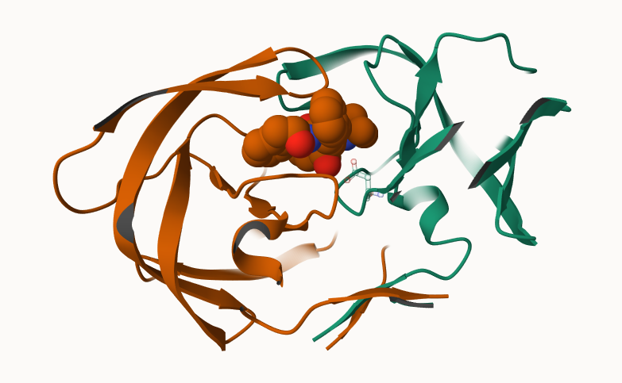

```{r setup, message=FALSE, warning=FALSE}
library(bio3d)
library(ggplot2)
library(ggrepel)
```

## Introduction to RCSB Protein Data Bank

### PDB Statistics

```{r}
pdb_stats <- read.csv("pdb_stats.csv")
pdb_stats
```

```{r}
total_structures <- sum(pdb_stats$Total)

xray_total <- sum(pdb_stats$X.ray)
em_total <- sum(pdb_stats$EM)

percent_xray <- xray_total / total_structures * 100
percent_em <- em_total / total_structures * 100

percent_xray
percent_em
```

**Q1: What percentage of structures in the PDB are solved by X-Ray and Electron Microscopy?**

X-ray crystallography accounts for \~80.95% of PDB structures Electron microscopy accounts for \~12.84% of PDB structures

```{r}
protein_rows <- grep("Protein", pdb_stats$Molecular.Type)
protein_total <- sum(pdb_stats$Total[protein_rows])

protein_proportion <- protein_total / total_structures
protein_percent <- protein_proportion * 100

protein_proportion
protein_percent
```

**Q2: What proportion of structures in the PDB are protein?**

The proportion of PDB structures that contain protein is approximately 0.979118, or 97.91%.

**Q3: How many HIV-1 protease structures are in the current PDB?**

After searching HIV-1 protease on the RCSB PDB website, I found that there are 1,227 HIV-1 protease structures.

## Visualizing HIV-1 Protease Structure

**Q4: Water molecules normally have 3 atoms. Why do we see just one atom per water molecule in this structure?**

In X-ray crystal structures, hydrogen atoms are often not visible because they scatter X-rays weakly. For water molecules, the oxygen atom is usually the only atom clearly modeled, so each water molecule appears as one atom.

**Q5: Conserved water molecule in the binding site**

The conserved water molecule in the HIV protease binding site is HOH 306.

**Q6: HIV Protease figure** The image shows the two chains of HIV protease, the bound ligand, the catalytic ASP 25 residues. I was not able to add a component for the conserved water molecule even after asking for help in piazza. Indinavir or larger ligands could enter the binding site through movement of the flexible flap regions of HIV protease. These flaps can open to allow substrate or inhibitor entry and then close over the ligand in the active site.

```{r}

```

## Introduction to bio3d

```{r}
pdb <- read.pdb("1hsg")
pdb
```

**Q7: How many amino acid residues are there in this pdb object?**

There are 198 amino acid residues in this PDB object.

**Q8: Name one of the two non-protein residues.**

One non-protein residue is HOH, which represents water. Another is MK1, the ligand.

**Q9: How many protein chains are in this structure?**

There are 2 protein chains, chain A and chain B.

```{r}
attributes(pdb)
head(pdb$atom)
```

## PDB Visualization

```{r}
# Optional interactive visualization
# install.packages("remotes")
# remotes::install_github("bioboot/bio3dview")
# install.packages("NGLVieweR")

library(bio3dview)
library(NGLVieweR)

view.pdb(pdb) |>
  setSpin()
```

```{r}
sele <- atom.select(pdb, resno = 25)

view.pdb(
  pdb,
  cols = c("navy", "teal"),
  highlight = sele,
  highlight.style = "spacefill"
) |>
  setRock()
```

## Predicting Functional Motions of a Single Structure

```{r}
adk <- read.pdb("6s36")
adk
```

```{r}
m <- nma(adk)
plot(m)
```

```{r}
mktrj(m, file = "adk_m7.pdb")
```

## Comparative Structure Analysis of Adenylate Kinase

```{r}
library(bio3d)
aa <- get.seq("1ake_A")
aa
```

**Q10: Which package is found only on BioConductor and not CRAN?**

The msa package is found on BioConductor and not CRAN.

**Q11: Which package is not found on BioConductor or CRAN?**

The bio3dview package is installed from GitHub, not CRAN or BioConductor.

**Q12: True or False? Functions from the pak package can install packages from GitHub and BitBucket?**

True.

**Q13: How many amino acids are in this sequence?**

The 1AKE chain A sequence has 214 amino acids.

## Search and Retrieve ADK Structures

```{r}
hits <- NULL
hits$pdb.id <- c(
  "1AKE_A", "6S36_A", "6RZE_A", "3HPR_A", "1E4V_A",
  "5EJE_A", "1E4Y_A", "3X2S_A", "6HAP_A", "6HAM_A",
  "4K46_A", "3GMT_A", "4PZL_A"
)

hits$pdb.id
```

```{r}
files <- get.pdb(hits$pdb.id, path = "pdbs", split = TRUE, gzip = TRUE)
files
```

## Align and Superpose Structures

```{r}
pdbs <- pdbaln(files, fit = TRUE, exefile = "msa")
pdbs
```

```{r}
library(bio3dview)
view.pdbs(pdbs)
```

## Annotate Collected PDB Structures

```{r}
ids <- basename.pdb(pdbs$id)
anno <- pdb.annotate(ids)

unique(anno$source)
anno
```

## Principal Component Analysis

```{r}
pc.xray <- pca(pdbs)
plot(pc.xray)
```

```{r}
rd <- rmsd(pdbs)

hc.rd <- hclust(dist(rd))

grps.rd <- cutree(hc.rd, k = 3)

plot(
  pc.xray,
  1:2,
  col = "grey50",
  bg = grps.rd,
  pch = 21,
  cex = 1
)
```

## PCA Visualization

```{r}
pc1 <- mktrj(pc.xray, pc = 1, file = "pc_1.pdb")
```

## Plotting PCA Results with GGPLOT2

```{r}
df <- data.frame(
  PC1 = pc.xray$z[, 1],
  PC2 = pc.xray$z[, 2],
  col = as.factor(grps.rd),
  ids = ids
)

p <- ggplot(df) +
  aes(PC1, PC2, col = col, label = ids) +
  geom_point(size = 2) +
  geom_text_repel(max.overlaps = 20) +
  theme(legend.position = "none")

p
```

## Normal Mode Analysis

```{r}
modes <- nma(pdbs)
plot(modes, pdbs, col = grps.rd)
```

**Q14: What do you note about this plot?**

The black and colored lines are not identical. The colored lines show larger fluctuations in certain regions, especially around the flexible nucleotide-binding regions of adenylate kinase. These regions likely differ the most because they are involved in conformational changes between open and closed states during ligand binding and enzyme function.
